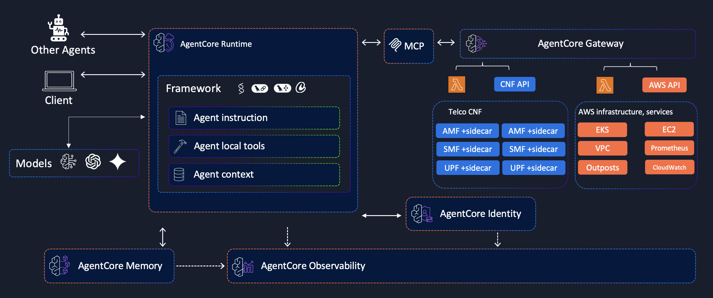

# Telco Multi-Agent Collaboration Pattern

## Overview

This document describes the multi-agent collaboration pattern for telecommunications infrastructure management using AWS AgentCore. The architecture enables intelligent 5G network management through specialized AWS agents that work together to provide comprehensive telco operations.

## Architecture Diagram

## Core Components

### 1. Telco Network Functions

The 5G core network functions that form the foundation of the telecommunications infrastructure:

- **UPF (User Plane Function)** - Handles user data traffic routing and forwarding
- **AMF (Access and Mobility Management Function)** - Manages device registration and mobility
- **SMF (Session Management Function)** - Handles session establishment and management
- **vCU (RAN Centralized Unit Function)** - Handles Radio Access Network higher portions of Layer 2 (L2) and all of Layer 3 (L3) functions
- **vDU (RAN Distributed Unit Function)** - Handles Radio Access Network Layer 1 (L1) and lower portions of Layer 2 (L2) functions

### 2. Agentic Sidecars

Each telco container is paired with an intelligent sidecar that:

- Monitors container health and performance
- Communicates with AWS agents for infrastructure management
- Provides correlation between telco functions and AWS services
- Enables automated remediation and optimization

### 3. AWS Specialized Agents

Four domain-specific agents handle different aspects of infrastructure management:

#### EKS Agent (`eks-agent`)
- **Purpose**: Amazon Elastic Kubernetes Service management
- **Gateway**: `eks-agentcore-gateway`
- **Key Tools**:
  - `eks_controlplane_upgrade()` - Upgrade EKS control plane
  - `eks_workernode_upgrade()` - Update worker node versions
  - `eks_workernode_scaleout()` - Scale out worker nodes
  - `eks_workernode_scalein()` - Scale in worker nodes

#### Outposts Agent (`outposts-agent`)
- **Purpose**: AWS Outposts hardware and infrastructure management
- **Gateway**: `outposts-agentcore-gateway`
- **Key Tools**:
  - `outposts_nic_firmware_update()` - Update network interface firmware
  - `outposts_hardware_initiate_fru()` - Initiate field replaceable unit replacement
  - `outposts_health_check()` - Perform comprehensive health checks

#### VPC Agent (`vpc-agent`)
- **Purpose**: Virtual Private Cloud networking and connectivity
- **Gateway**: `vpc-agentcore-gateway`
- **Key Tools**:
  - `vpc_reachability_check()` - Test network connectivity
  - `vpc_create_tgw()` - Create transit gateway connections
  - `vpc_start_flowlogs()` - Enable VPC flow logging
  - `vpc_check_routetable()` - Validate routing configurations

#### Prometheus Agent (`prometheus-agent`)
- **Purpose**: Monitoring and observability with Amazon Managed Prometheus
- **Gateway**: `prometheus-agentcore-gateway`
- **Key Tools**:
  - `prometheus_query()` - Execute PromQL queries
  - `prometheus_range_query()` - Perform time-range queries
  - `prometheus_list_metrics()` - Discover available metrics

## Communication Flow

### 1. Telco Container ↔ Agentic Sidecar
- **Relationship**: 1:1 pairing
- **Communication**: Local container networking
- **Purpose**: Health monitoring, performance metrics, operational status

### 2. Agentic Sidecar ↔ AWS Agents
- **Relationship**: Many-to-many
- **Communication**: Secure API calls via AgentCore
- **Purpose**: Infrastructure management, correlation, automated remediation

### 3. AWS Agent ↔ AgentCore Gateway
- **Relationship**: 1:1 dedicated connection
- **Communication**: AgentCore protocol
- **Purpose**: Tool execution, memory management, authentication

## Key Benefits

### Intelligent Automation
- Automated infrastructure management based on telco workload requirements
- Proactive issue detection and remediation
- Cross-domain correlation for holistic network management

### Scalability
- Independent scaling of telco functions and infrastructure agents
- Distributed decision-making across specialized domains
- Efficient resource utilization through intelligent orchestration

### Observability
- Comprehensive monitoring across telco and infrastructure layers
- Real-time metrics and alerting
- Historical analysis and trend identification

### Reliability
- Fault isolation between telco functions and infrastructure management
- Automated failover and recovery procedures
- Continuous health monitoring and validation

## Implementation Considerations

### Security
- Secure communication channels between all components
- Role-based access control for agent operations
- Audit logging for all infrastructure changes

### Performance
- Low-latency communication for real-time operations
- Efficient resource utilization across all agents
- Optimized tool execution and response times

### Maintenance
- Independent deployment and updates for each agent
- Centralized configuration management
- Comprehensive testing and validation procedures