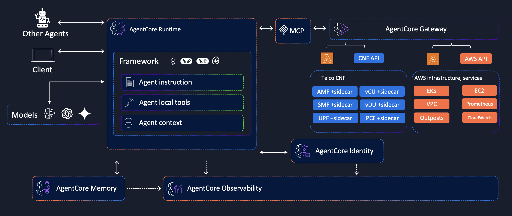

# Telco Multi Agent Collaboration Pattern

## 🔗 Key Relationships:

Telco Containers (UPF, AMF, SMF) + Agentic Sidecar  → AWS Agent(s): eks-agent, outposts-agent, vpc-agent, prometheus-agent
• Each Telco container + agentic sidecar pair communicate with AWS Agent(s)
• Agentic sidecar will communicate with AWS Agent(s) for information exchange and correllation

AWS Agent(s) are connected 1:1 with AgentCore Gateways
• All AWS Agents has it's own AgentCore Gateways
• AgentCore Gateways has multiple tools related with it's specific domain

AgentCore Gateways → tools(), the tools are specific for the Agent's domain
• eks-agent connected to eks-agentcore-gateway which has multiple tools: eks_controlplane_upgrade(), eks_workernode_upgrade(), eks_workernode_scaleout(), eks_workernode_scalein(), etc.
• outposts-agent connected to outposts-agentcore-gateway which has multiple tools: outposts_nic_firmware_update(), outposts_hardware_initiate_fru(), outposts_health_check(), etc.
• vpc-agent connected to vpc-agentcore-gateway which has multiple tools: vpc_reachability_check(), vpc_create_tgw(), vpc_start_flowlogs(), vpc_check_routetable(), etc.
• prometheus-agent connected to prometheus-agentcore-gateway which has multiple tools: prometheus_query(), prometheus_range_query(), prometheus_list_metrics(), etc.

## 🛠️ Key Relationships Diagram:

## 🔗 Key Architecture Components:

🏗️ Telco Containers + Agentic Sidecars:
• **UPF, AMF, SMF**: Core 5G network functions
• **UERANSIM**: 5G UE simulator for testing
• **gNB**: 5G Radio Access Network base station
• **Agentic Sidecars**: Handle AWS communication and correlation

🤖 AWS Agents (1:1 with AgentCore Gateways):
• **eks-agent** → EKS management and operations
• **outposts-agent** → Outposts hardware and infrastructure
• **vpc-agent** → VPC networking and connectivity
• **prometheus-agent** → Monitoring and metrics

🛠️ AgentCore Gateways with Domain-Specific Tools:
• **EKS Gateway**: Cluster upgrades, node scaling, worker management
• **Outposts Gateway**: Hardware updates, FRU replacement, health checks
• **VPC Gateway**: Connectivity tests, transit gateway, flow logs, routing
• **Prometheus Gateway**: Metric queries, range queries, metric discovery

📡 Information Exchange & Correlation:
• Bidirectional communication between all components
• Real-time monitoring and management capabilities
• Cross-domain correlation for holistic 5G network management

This architecture enables intelligent 5G network management through AWS-native agents and tools.